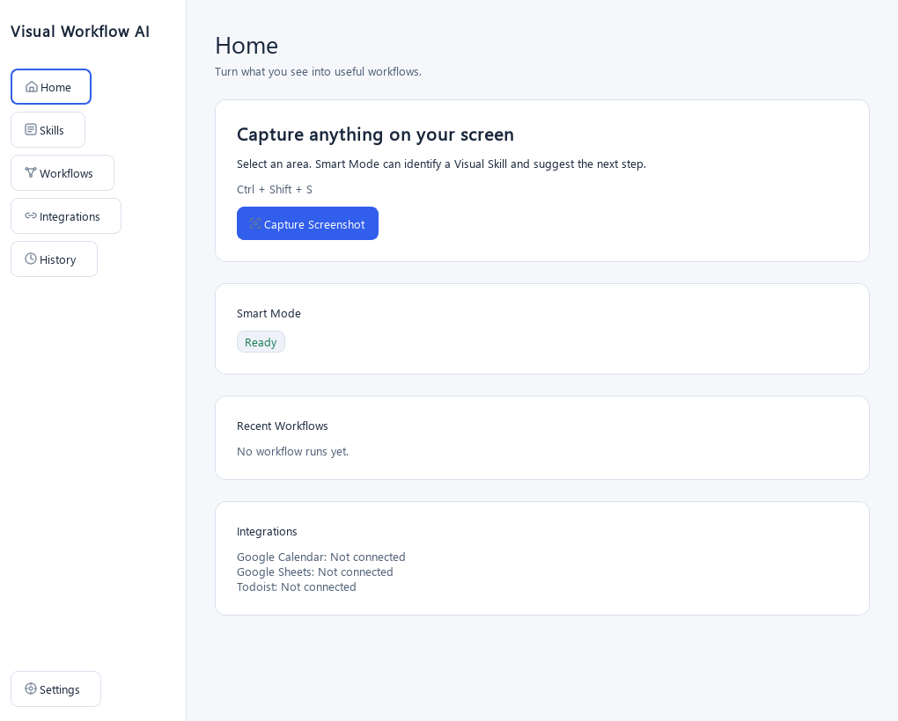
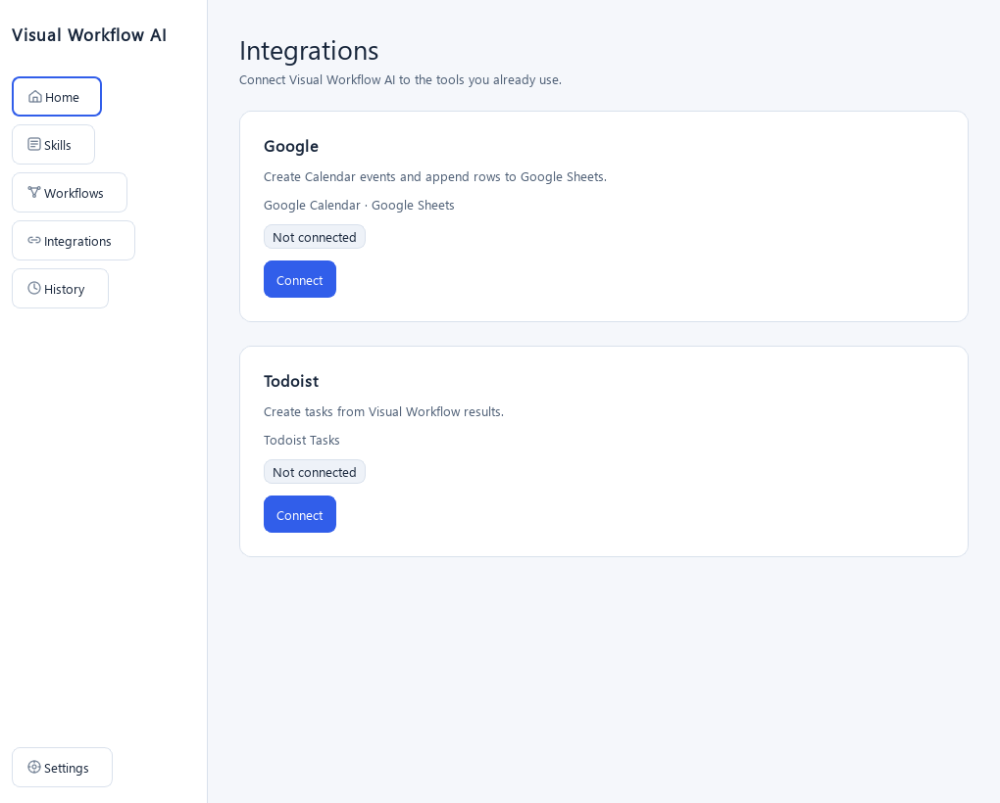
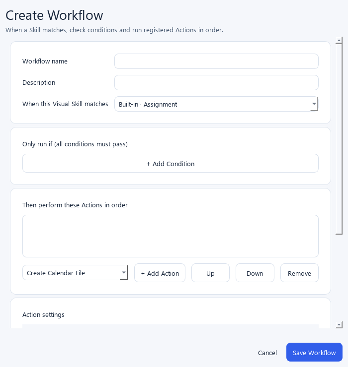

# Visual Workflow AI

Visual Workflow AI turns screen content into structured information and user-configurable actions. Press **Ctrl+Shift+S**, select a screen region, review the result, and run a local or connected Workflow. Windows 10/11 and Python 3.11+ are required.

```text
Screen → Understand → Visual Skill → Structured Data → Workflow → Local / Cloud Actions
```

The app opens from the system tray into a Home dashboard with Skills, Workflows, Integrations, History, and Settings. Appearance follows the system theme by default; Light and Dark are available in Settings.



Dark appearance and the floating result use the same design system: [dark Home](assets/screenshots/home-dark.png) · [Smart result](assets/screenshots/result-dark.png).

## Features

- Native Windows global hotkey, configurable in Settings.
- Drag selection on any display, bright selection preview, Esc cancellation.
- In-memory PNG capture with display scaling correction and optional downscaling.
- Background vision requests with loading state and readable errors.
- Smart, Ask, Debug, Extract, Explain, and Translate modes.
- Ask conversation, structured diagnostics, and extracted tables/code/fields with contextual copy buttons.
- Tray menu, configurable always-on-top behavior, and JSON settings.

## Demo

### Phase 1 workflows

- **Ask:** free-form answers with an inline follow-up field. The last six conversation turns stay in memory for the current screenshot. Retry starts a fresh conversation; replacing or closing the screenshot clears it.
- **Debug:** separate Detected Problem, Evidence, Likely Cause, Suggested Fix, and Confidence sections. Copy Error and (when a fix exists) Copy Fix copy locally. Ask AI and Explain Why continue in Ask with the diagnostic as context.
- **Extract:** identifies text, code, table, receipt, contact, event, assignment, JSON, or URL. Tables use a grid with CSV/JSON/Markdown copy actions; code uses a monospace view and Copy Code; other types show extracted fields. Nothing is executed or sent to another app by copy actions.
- **Explain / Translate:** retain their existing text workflows for later phases.

Malformed structured answers show a retryable error instead of guessed data. Old General and Summarize settings migrate to Ask; Extract Text migrates to Extract.

### Smart mode - Phase 3

AI Screenshot Helper automatically detects supported screenshot types and turns them into structured actions.
Choose **Smart**, capture a region, review the extracted details, then choose an action.

| Smart Skill | Structured information | Local actions |
| --- | --- | --- |
| Assignment | Course, title, deadline, points, instructions, submission | Calendar file, details, Markdown, Ask AI |
| Event | Date/time, location, meeting link, organizer | Calendar file, meeting link, details, Ask AI |
| Code Error | Problem, evidence, likely cause, suggested fixes | Copy error/fix/diagnosis, Explain, Ask AI |
| Table | Headers, rows, notes | CSV, JSON, Markdown, tab-separated text, Ask AI |
| Unknown or uncertain | Ask response | Existing conversation workflow |

```text
Screenshot -> Classifier -> Smart Router -> Skill Registry -> Skill
    -> Parse -> Validate -> Normalize -> SkillResult -> Dynamic UI -> Action Registry
```

Smart uses two background AI requests: classification and skill extraction (or Ask fallback).
Classification confidence must meet `smart_classification_threshold` (default `0.75`).
Confidence is a model estimate. Missing fields are hidden; malformed JSON offers Retry and Ask AI.
Closing a result invalidates late replies. Ask AI retains the original screenshot and validated structured data.
Manual Ask, Debug, Extract, Explain and Translate remain available.

Copy actions use the system clipboard. Calendar export opens a save dialog and writes a local `.ics` file;
it never opens URLs or connects to calendar accounts. Missing dates disable calendar export; missing times
produce all-day events. Dates without a clear year remain empty. Missing timezones use floating local time
with an on-screen note. UTC, explicit offsets and IANA zones are supported; ambiguous abbreviations and
DST transition times require clearer source data. End times at/before start are omitted with a warning.
Table previews show at most 10 rows, while exports include all rows.

Settings is owned by the result window and brought to the foreground on every open, including when results
are set to always stay on top.

Offline and optional live evaluation:

```powershell
python -m scripts.generate_smart_samples
python -m scripts.evaluate_skills
python -m scripts.evaluate_skills --live --limit-per-category 1
python -m tests.render_phase3
```

The default evaluation only inventories local samples. `--live` sends images to your provider and may incur
charges. Add `01.expected.json` beside `01.png` with expected normalized fields (including missing-field nulls)
to score factual extraction, not just JSON validity. Logs/metrics exclude extracted content and passcodes.
Review real screenshots for correctness, completeness and invented fields before relying on the results.

`Ctrl+Shift+S → drag over a paragraph/code/error → release → answer → Copy`

To try capture without an API key or network request:

```powershell
python main.py --preview
```

This displays a thumbnail of the selected region. No screenshots are written to disk.

## Installation

Open PowerShell in this project folder:

```powershell
python -m venv .venv
.\.venv\Scripts\Activate.ps1
python -m pip install -r requirements.txt
```

If activation is unavailable, use `.\.venv\Scripts\python.exe` in place of `python`.
The project uses PySide6, python-dotenv, the official OpenAI SDK, and tzdata for Windows calendar timezone support.

When started with `python main.py`, the app checks for these packages first. If one
is missing, it automatically runs pip with the same Python interpreter and installs
the requirements for the current user (or into the active virtual environment).
Internet access and pip are required for this first-run setup. For a more reliable
end-user experience, distribute a packaged executable or pre-created virtual
environment instead of relying on runtime installation.

## Setup API Key

```powershell
Copy-Item .env.example .env
notepad .env
```

Set `AI_API_KEY` to your API key. `AI_MODEL` defaults to `gpt-4.1-mini`; choose a vision-capable model available to your API account. `AI_BASE_URL` defaults to `https://api.openai.com/v1`. A different service must support the same Chat Completions image request format.

For SiliconFlow, use `https://api.siliconflow.cn/v1` and a vision model available in your SiliconFlow account, for example `Qwen/Qwen2.5-VL-72B-Instruct`. Set `AI_IMAGE_DETAIL=low` for smaller screenshot requests. SiliconFlow model availability can change, so copy the exact model ID from its model list.

Alternatively, enter a key through tray → Settings. That key lasts only for the current process and is never written to `config.json`. Environment variables take precedence over `.env`; restart after editing `.env`.

The client sends PNG data using the [documented image input format](https://developers.openai.com/api/docs/guides/images-vision). Each selection, mode change with a retained screenshot, or Ask Again sends a new request to the configured provider and may incur API charges. There is no local OCR stage or screenshot history. `.env` and `config.json` are ignored by Git.

## Running

```powershell
python main.py
```

The application starts in the system tray (check Windows' hidden icons). Double-click its icon or choose **Capture Screenshot**. Closing the popup keeps the app running. Choose **Quit** in the tray menu to exit. If a request is active, Quit waits for it to finish or time out without freezing the GUI.

For this workspace, a portable test runtime is also available:

```powershell
..\.python-runtime\python.exe main.py
```

## Keyboard Shortcuts

| Shortcut | Action |
| --- | --- |
| Ctrl+Shift+S | Start capture from any application |
| Esc | Cancel selection without an AI request |

Settings supports combinations of Ctrl, Alt, Shift, Win and a letter or number. Hotkey conflicts produce an error; tray capture stays available. The source plan included both S and A: this implementation consistently defaults to S. Set `ctrl+shift+a` in Settings if preferred.

## Project Architecture

| File | Responsibility |
| --- | --- |
| `main.py` | Qt entry point |
| `src/app.py` | Tray lifecycle, capture coordination, thread-pool worker |
| `src/config.py` | Validated JSON settings and hotkey parsing |
| `src/hotkeys.py` | Windows RegisterHotKey / Qt native events |
| `src/screenshot.py` | Screen snapshots, logical-to-physical crop, resize, PNG encoding |
| `src/llm_client.py` | Provider-specific requests, credentials, error mapping |
| `src/prompts.py` | Central mode labels and prompts |
| `src/modes.py` | Debug/Extract contracts, result model, and JSON validation |
| `src/actions.py` | Shared CSV/Markdown and manual mode serializers |
| `src/skills/` | Skill contracts, registry, four schemas/prompts, normalization and extraction worker |
| `src/skill_actions.py` | Action definitions, availability and payload generation |
| `src/calendar_export.py` | Local iCalendar serialization, escaping, folding and timezone conversion |
| `src/ui/skill_view.py` | Skill-driven fields, diagnostics and bounded table previews |
| `src/ui/skill_actions.py` | User-triggered clipboard, save dialog and follow-up adapter |
| `src/ui/structured_result.py` | Diagnostic sections and extracted tables/code/fields |
| `src/ui/` | Selection, results, settings widgets |
| `tests/` | Offline unit and Qt integration tests |

Settings are saved atomically to `config.json` beside `main.py`. Invalid configuration shows an error and uses defaults for the session; it is only replaced when Settings is saved. Screenshots are taken before the overlays appear so the tint and border are excluded. Captures and requests run one at a time. Close discards the retained image and ignores late responses.

## Validation

```powershell
python -m unittest discover -s tests -v
python -m compileall -q main.py src tests
python main.py --smoke-test
```

The smoke check starts the real application, registers the hotkey and tray, then exits. Tests cover prompt/config validation, scaled crop and PNG round trip, API payload/error handling, native hotkey dispatch and conflicts, mouse selection, Esc, background response delivery, Copy, and late-result suppression.

Manual acceptance checklist:

1. Run `--preview`; capture a known rectangle on each display at its normal scaling. Confirm correct pixels and Esc cancellation.
2. Configure a real key and capture a paragraph, Python code, an error, and a table. Compare Ask, Debug, and Extract on the same screenshot; check Explain and Translate too.
3. Try follow-up questions, Retry, and contextual copy actions. Close while analyzing; confirm the popup stays closed.
4. Change the hotkey, restart, and confirm persistence. Test a shortcut already used by another app.
5. Disconnect the network and check the readable error. Quit during a request.

## Limitations

- Selection stays within one display; cross-monitor drags are clipped to the starting display.
- Protected content, secure desktops, and some exclusive full-screen applications may not be capturable.
- Requests use a 45-second network timeout and no automatic retries. Closing a result suppresses the answer but cannot retract a submitted request. A new capture waits for the active request to finish.
- Ask follow-ups resend the original image with up to six previous turns. This context is kept only in memory.
- JSON structure is validated locally; factual accuracy and confidence remain dependent on the configured vision model. Large responses may exceed AI_MAX_TOKENS and require a smaller capture or a higher configured limit.
- No streaming, installer, auto-start, or automatic updates in this MVP.
- Automated tests use a mocked AI service. Real model recognition and physical multi-monitor/hotkey interaction still require the manual checks above.

## Roadmap

Phase 6 adds bounded Google Calendar, Google Sheets, and Todoist Actions to the existing Workflow engine. Gmail, arbitrary HTTP Actions, scripts, browser automation, and cloud synchronization remain outside this release.

## Custom Visual Skills (Phase 4)

Users can teach AI Screenshot Helper to recognize new screenshot types, define structured extraction
fields, and attach reusable actions without writing code.

Open **system tray → Visual Skills**. Choose **Create Skill**, enter a name and detection condition,
add and reorder fields, select actions, and save. Double-click a custom skill to edit it. The manager
also supports enable/disable, duplicate, test, export, import, and deletion with confirmation.
Built-ins are shown separately and keep matching priority.

Supported fields: `string`, `multiline_text`, `number`, `date` (YYYY-MM-DD), `time` (HH:MM), ISO `datetime`,
`boolean`, HTTP(S) `url`, `email`, and `list_string`. Definitions support 1–20 fields and a detection
condition up to 1000 characters. Editing labels preserves saved IDs. Missing required values produce
warnings rather than invented data; missing optional fields are hidden.

**Teach From Screenshot** accepts a local image and a purpose, such as “Track receipts and extract
merchant, total and date.” Generate sends that image to your configured AI provider and opens a validated
draft in the editor. Review, test, and enable it when ready. Generated drafts are never saved automatically.
**Test Skill** works with unsaved or disabled definitions, displays match confidence, and only extracts
when confidence reaches 75%. Low-confidence results invite editing or another screenshot.

```text
Screenshot → Built-in classifier → Confident built-in → Existing skill
                         ↓ otherwise
                 Enabled custom skills (one matcher request)
                         ↓ match ≥ 75%              ↓ no match / error
                 Runtime schema extraction          Ask
                         ↓
                 Dynamic fields + configured actions
```

Actions: **Copy JSON**, **Copy Markdown**, **Copy Plain Text**, **Save CSV**, and **Ask AI**. CSV exports
one screenshot as one row with field labels as headers; formula-like text is neutralized for spreadsheet
safety. Ask AI reuses the original screenshot and validated result context. No action runs automatically.

Definitions live in `%APPDATA%\AI Screenshot Helper\custom_skills.json` on Windows. Saves use atomic replacement;
damaged files are preserved as `.bak` files before recovery. Unsupported storage versions are read-only.
The fallback location is `~/.local/share/AI Screenshot Helper/`. Changes take effect without restarting.
Open result cards retain their original labels even if a definition changes or is deleted.

Export uses versioned JSON `.aiskill` files containing definitions only—no images, extracted results, or
credentials. Imports validate versions/types, remove unsupported actions with a warning, and create a
unique copy on duplicate IDs. Definitions cannot run scripts or arbitrary commands.

AI matching, extraction, testing and teaching run off the Qt UI thread. Closing a dialog suppresses late
results but cannot retract a submitted provider request. Quitting waits for pending requests. Custom skills
cannot override confident built-ins. Model accuracy requires live acceptance testing; large generated
schemas may require a higher `AI_MAX_TOKENS`.

`src/skills/custom/` owns models, storage, prompts, validation, runtime, matching, generation and interchange;
`src/ui/skills/` owns editing, testing and teaching. Both built-in and custom skills use `SkillResult` and
the action registry. Run `python -m unittest discover -s tests -v` for offline coverage. Synthetic examples
and the provider acceptance checklist are in `tests/manual_samples/custom/README.md`.

## Visual Workflows

Visual Skills determine what a screenshot means. Visual Workflows determine what happens next.

Open **Visual Workflows** from the tray to create a Workflow. Pick a built-in or custom Visual Skill, add AND conditions and ordered Actions, then choose Suggest or Auto. Suggest shows a Run button with the Skill result; Auto requires confirmation before it can execute after a screenshot match. **Run Test** previews Actions without changing files or the clipboard. History keeps recent statuses without screenshots or extracted data. Workflows can be duplicated, exported and safely imported in disabled Suggest mode.

See [Visual Workflows usage and architecture](WORKFLOWS.md) and the [Phase 5 validation report](PHASE5_REPORT.md).

## Integrations and cloud Workflows (Phase 6)

Open **Home → Integrations** to connect Google or Todoist. Google requires a **Desktop OAuth client ID** from your Google Cloud project. Choose Calendar, Sheets, or both before browser consent. Google desktop OAuth does not support true incremental authorization; adding a capability requires reconnecting with the combined scope set. Todoist uses a personal API token entered in the masked connection dialog. Tokens and Google authorization records are stored in Windows Credential Manager, while `integrations.json` holds only connection status, account label, and granted capability names. Disconnect removes the local credential without deleting any Workflow.



The Workflow editor offers three registered external Actions:

| Action | Configuration | Write |
| --- | --- | --- |
| Create Google Calendar Event | Calendar ID, title template, date and optional time/description/location/reminder fields | One event |
| Append Google Sheet Row | Spreadsheet ID or Google Sheets URL, tab, ordered column-to-Skill-field mapping, optional header creation | One row, after header validation |
| Create Todoist Task | Project ID, title/description templates, optional due date/time fields, priority | One task |

Use a Skill result to **Run Test** before enabling a Workflow. Dry Run prepares the mapped values and shows what would be sent without making an external write. New Workflows use Suggest mode. Switching to Auto asks for explicit confirmation and names the external Actions. Imported Workflows stay disabled in Suggest mode until reviewed. When an integration is disconnected or needs reauthorization, its Action fails with a connection message. A timeout after a write reports an unknown result; review the service account before retrying, since writes are never retried automatically. Workflow History saves execution and step status metadata, without screenshots, extracted field values, or credentials.



The [Visual Skill editor](assets/screenshots/skill-editor-light.png) uses the same cards and scrollable layout.
The [Skills overview](assets/screenshots/skills-light.png) and [Workflow overview](assets/screenshots/workflows-light.png) show built-in/custom Skills and ordered Actions.

See [Integration architecture and setup](INTEGRATIONS.md) for connection steps, scope choices, testing, and limitations. The included [render script](tests/render_phase6.py) creates synthetic UI screenshots without account access or network requests.
